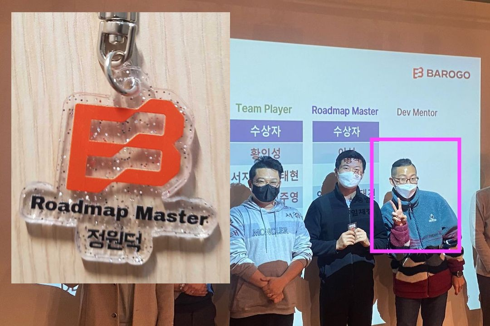
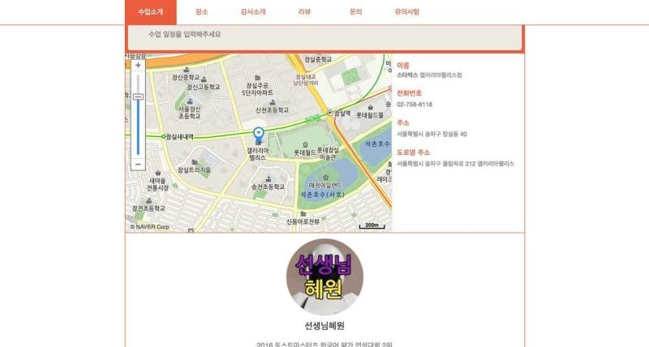

# 이력서
# 정원덕
## 전화번호
010-4613-5949
## 이메일
<wonder13662@gmail.com>
## 노션
[프론트엔드 정원덕의 이력서](https://www.notion.so/47aad8eb54be4487bd0914a4ffedb161)

# 자기소개
- 웹 클라이언트의 생산성을 더 높이면 더 나은 세상을 만들 수 있다고 믿습니다.
- 코드를 미래의 변화에 유연하게 만듭니다.
- 코드 작성 또는 리뷰시에 마틴 파울러의 Refactoring을 기반으로 진행합니다. [Refactoring V2](https://www.notion.so/Refactoring-V2-77a8b4de5e854b33bd57ade3187d2f77)
- 코드는 공동의 산물이라고 생각합니다. 누구나 읽기 쉽고 수정하기 쉽도록 작성합니다.
- 최상의 협업환경을 만드는 데 관심이 많습니다. 코딩 컨벤션, 좋은 리뷰 문화를 위해 노력합니다.
- 새로운 기술적인 도전을 즐깁니다. 그리고 도전의 결과가 실제 프로덕트에 반영되는 것을 이뤄냅니다.
# 바로고
## 회사 소개
[바로고](https://www.barogo.com/)는 단거리 이륜 물류(음식) 배송 솔루션을 제공하는 업체입니다. 2023년 현재 이륜 음식 배송 1위 업체입니다.
## 기술 셋
- Vue.js(4)
    - Vue.js 기업용 프로젝트 템플릿를 만들 수 있습니다.
    - 재사용과 확장성이 뛰어난 컴포넌트로 생산성을 올릴 수 있습니다.
    - 협업 관점에서 용이한 프로젝트 구조를 설계할 수 있습니다.
- Javascript ES6(4)
    - 비동기 처리 및 에러 핸들링에 대해 일관된 흐름을 설계할 수 있습니다.
- SCSS(3)
    - 프로젝트에 필요한 스타일을 설정하여 재사용(import)할 수 있습니다.
- Jest(3)
    - Unit 단위의 자동화 테스트를 작성할 수 있습니다.
    - 페이지별 시나리오 테스트를 Component 단위의 자동화 테스트를 작성할 수 있습니다.
    - 테스트를 위한 SPA 프레임웍에 필요한 설정을 제어하고 개선할 수 있습니다.
- GraphQL(3)
    - GraphQL Apollo Client에 전, 후처리 및 Auth 토큰 관련 처리를 제어할 수 있습니다.
    - 에러 핸들링을 위한 Error 객체 처리 흐름을 설계 및 적용할 수 있습니다.
- Socket.io(3)
    - 서버에서 전달하는 푸시 메시지를 서비스 맥락에 따라 적절한 필터링을 하는 구조를 작성할 수 있습니다.
- RESTful API(3)
    - Axios에서 accessToken, refreshToken을 이용한 인증과 갱신을 구현할 수 있습니다.
- POSTMAN(3)
    - 환경설정을 통하여 로그인 이후 얻은 accessToken으로 인증된 Api 통신을 진행할 수 있습니다.
    - dev, production등의 환경을 바꿀 수 있습니다.
    - git에 Api collection, environment(환경변수)를 등록하여 버전 관리를 할 수 있습니다.

### Skill Level

(1) **Novice**

해당 능력/지식이 무엇인지 알고는 있지만, 관련 업무 수행 경험이 충분치 않고 도움이 필요한 수준

(2) **Developing**
능숙하진 않지만 기본적인 업무 수행 가능한 수준, 관련 업무 경험이 있지만 때때로 도움이 필요할 수 있음

(3) **Proficient**

관련 지식과 경험이 풍부하여 능숙하게 업무 수행이 가능함, 도움은 필요 없는 수준

(4) **Advanced**

관련 지식과 경험에 전문적이며 다른 사람을 리드하고 교육할 수 있는 정도의 수준

## 기간

2019-12 ~ 재직중(총 3년 1개월)

## 주요 작업

### 멀티연계배송 프로젝트의 프론트 기반 작성

- 주문받기 부터 배송완료까지 기본 배송 플로우 구현
- Vue.js 2 기반의 기업용 프로젝트 구조
- 환경별 Vue CLI + Webpack v4 빌드 구조 작성
- eslint 커스터마이징
- REST API, Socket, graphql 통신 클라이언트 추가
- i18n(국제화) 모듈 추가
- VueRouter global guard를 통해 권한별 페이지 접근 제한

### 멀티연계배송 프로젝트의 프론트 고도화

- 기본 배송 플로우에서 발생할 수 있는 모든 예외 상황에 대한 처리 추가됨
    - [🎟️CS티켓 플로우](./barogo/CSTICKET_FLOW.md)
    - [🎣배차지연 - 블랙드라이버 배차](./barogo/GRAB_DELAY.md)
    - [🛺배차취소](./barogo/CANCEL_DELIVERY.md)
- 배송 지역과 관련 배송들의 상태를 한번에 볼 수 있는 통합관제 페이지 추가
    - [📊통합관제](./barogo/CONTROL_ROOM.md)
- 기간할증(우천, 프로모션등)을 제어할 수 있는 기능 추가
    - [🪙기간할증 플로우](./barogo/PERIOD_OPTION_FEE_TYPE.md)
- 재사용 가능한 컴포넌트들로 추상화하여 코드 생산성을 높임
    - [👛Wallet 공통 컴포넌트](./barogo/WALLET_COMPONENT.md)
- 네이버 지도 + 우버의 h3.js를 모듈화하여 복잡한 기능(지도 위에 영역그리기 등)을 구현
    - [🗺️NaverMap 모듈화](./barogo/NAVER_MAP_MODULE.md) 
- 관제 상황의 중요 정보를 푸시로 받을 수 있는 흐름 설계
    - [🚃Socket to Veux.store](./barogo/SOCKET_TO_VUEX_STORE.md)
- 페이지 단위의 자동 테스트(Jest)를 추가하여 코드 안정성을 높임
    - [🔍Component test:Jest](./barogo/COMPONENT_TEST_JEST.md)
- 에러 핸들링 방식을 통일하여 일관된 에러 메시지를 로그 서버로 전송

### 멀티연계배송 서비스 CBT

- 3일간 150개의 배송을 마무리
- 프론트 관제와 운영 페이지의 기능이 대부분 검증됨. 크리티컬 에러 없음

### 개발문화 개선

- 프론트 파트 코딩 컨벤션 개선 [코딩컨벤션(로지스팀 프론트엔드)](./barogo/FRONTEND_CODING_CONVENTION.md)
- 프론트엔드 인턴 멘토링 [인턴쉽 멘토링 참여](./barogo/INTERNSHIP_MENTORING.md)
- 스터디 리드 및 참여 [스터디](https://www.notion.so/7d9b6df12e2a46378b7b327225127fab)

## 2022년의 성과
### 🦅 FE 파트의 태스크 관리를 막힘없이! 🦅 Roadmap Master 수상!

### 🐣테크니컬 리더십의 성장🐣 멘토링 대상인턴 5명중 4명 정사원 입사

[🐣인턴쉽 멘토링 참여](./barogo/INTERNSHIP_MENTORING.md)
### 🏆 팀 프로젝트 커밋 챔피언 🏆

# Swingvy
## 회사 소개
[스윙비](https://www.swingvy.com/)는 B2B HR 소프트웨어 플랫폼 서비스 회사입니다. 2023년 현재 대만, 싱가폴을 중심으로 서비스를 제공하고 있습니다.

## 기간
2017-05 ~ 2019-09

## 기술 셋

- React
- Javascript ES6
- Webpack 2
- Jest(Unit test)
- Cypress(E2E test)

### 급여지급 시스템 개발

- 급여 지급 웹 클라이언트 제작을 맡음
    
    
    
- 재사용 가능한 컴포넌트로 코드 재사용성을 높임
- Jest Unit 테스트 작성
- Cypress E2E 테스트 작성
- Github을 통한 Git flow 프로세스, PR 코드 리뷰

### React + Bootstrap 컴포넌트

- Bootstrap을 기반으로 한 컴포넌트 제작.
- Design system의 초안의 형태를 제작하여 제안

### React Seeder

- React 프로젝트를 시작할 수 있는 보일러 플레이트, seeder 제작
- Webpack 2를 기반으로 제작
- 기존의 Backbone.js 레거시를 대체하기 위한 용도

# 카페클래스

## 기간
2016-10 ~ 2017-01

## 기술 셋

- Angular 2
- Javascript ES5
- PHP(Code Igniter)
- SVN

### 카페클래스 웹 프로토타입 제작
- 로그인 페이지

- 선생님 등록 페이지

- 수업상세 페이지(수업장소)

- 수업상세 페이지(수업정보)

- 수업 목록

- 영어 회화 수강 웹 페이지를 서버는 PHP, 클라이언트는 Angular 2로 작성
- 회사 사정으로 프로덕션 단계로 진행하지는 못함

# XOGames

## 기간
2016-07 ~ 2016-10

## 기술 셋

- Jquery
- Bootstrap
- PHP 5.5
- MySQL 5.6

### Quiz rumble의 어드민 페이지 제작

- 프리랜서 업무
- 모바일 게임 Quiz rumble의 퀴즈 제작 어드민 페이지 제작

- 엑셀로 등록된 다수의 퀴즈를 비동기로 DB에 업로드.

- 무료의 복수의 이미지(GettyImages)를 비동기로 로딩하여 서버에 저장하는 기능을 구현

- 퀴즈 시뮬레이터로 업로드한 퀴즈 데이터를 테스트

# Daum Kakao

## 기간
2010-12 ~ 2015-12

## 기술 셋

- Java 6
- JUnit
- Jquery
- Javascript ES5
- Mysql 5
- Adobe Flash + Action Script 2

### VOD 서비스 티비팟 운영툴 유지보수

- Daum의 콘텐츠 서비스 티비팟의 운영자 페이지 유지보수
- Base shell(Linux), Powershell(Windows) 배포 및 관리를 위한 스크립트 제작
- DOM 객체를 쉽게 다루기 위해 Jquery를 이용한 자체 UI 프레임워크 제작
- 폭력, 음란 영상을 막기위한 Api 연동

### VOD 사용자 규제 시스템 제작

- 규제 단계 시스템 제작(규제 위반시 이메일 경고, 정지, 탈퇴처리)
- 각 단계의 예외상황 및 정상작동 확인을 위해 JUnit으로 테스트 코드 작성

### VOD 업로더 유지보수

- Adobe Flash로 비디오 파일 업로더 제작