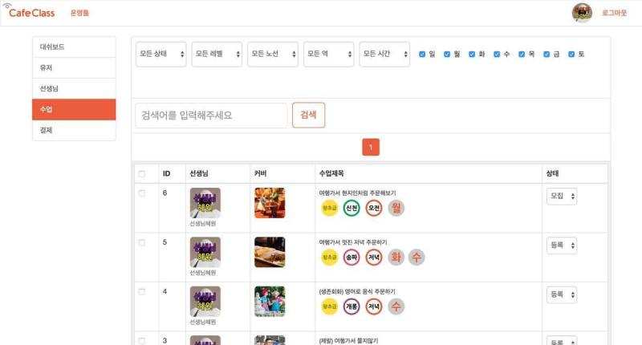

# 이력서
# 정원덕
## 전화번호
010-4613-5949
## 이메일
<wonder13662@gmail.com>
## 노션
[프론트엔드 정원덕의 이력서](https://www.notion.so/47aad8eb54be4487bd0914a4ffedb161)

# 바로고
## 회사 소개
[바로고](https://www.barogo.com/)는 단거리 이륜 물류(음식) 배송 솔루션을 제공하는 업체입니다. 2023년 현재 이륜 음식 배송 1위 업체입니다.
## 기간
2019-12 ~ 재직중

## 기술 셋

- Vue.js
- Javascript ES6
- SCSS
- Jest
- GraphQL
- Socket.io
- RESTful API
- POSTMAN

## 2022년의 성과

## #1 🔗멀티연계배송 관제 운영툴🔗 Close Beta Test 통과!

## #2 🦅 FE 파트의 태스크 관리를 막힘없이! 🦅 Roadmap Master 수상!

## #3 🐣테크니컬 리더십의 성장🐣 멘토링 대상인턴 5명중 4명 정사원 입사

[🐣인턴쉽 멘토링 참여](./barogo/INTERNSHIP_MENTORING.md)

## #4 🗺️네이버 지도 Api + H3 공용 모듈🗺️ 팀을 넘어 R&D 그룹이 함께 쓴다

[🗺️NaverMap 모듈화](./barogo/NAVER_MAP_MODULE.md) 

## #5 🎲회귀테스트도 자동화한다🎲 Jest 기반 시나리오 테스트

[🎲Component test:Jest](./barogo/COMPONENT_TEST_JEST.md) 

## #6 🏆 팀 프로젝트 커밋 챔피언 🏆

## 2022-04 ~ 2023-01

### 중점 목표

- 리더십 강화
    - 프론트엔드 영역만이 아닌 다른 파트와 다른 팀에 도움을 줄 수 있어야 한다.
    - 프론트파트의 태스크 운영과 협업을 매니징할 수 있어야 한다.
- 유연하고 빠른 페이스의 프로젝트의 산출물을 빠르게 내놓을 수 있어야 한다.

### 배송 서비스의 배송 통합 관제 기능 강화

- 통합관제 통계데이터 표시 및 연결되는 세부배송 화면 구현을 함으로써 전체적인 배송상황을 빠르게 파악할 수 있음
    - [📊통합관제](./barogo/CONTROL_ROOM.md)
- 일반 문의 CS 티켓과 배송 문의 CS 티켓 구현
    - [🎟️CS티켓 플로우](./barogo/CSTICKET_FLOW.md)
    - [🎣배차지연 - 블랙드라이버 배차](./barogo/GRAB_DELAY.md)
    - [🛺배차취소](./barogo/CANCEL_DELIVERY.md)
- 기간할증과 지역그룹을 연동하여 기간할증 또는 지역그룹의 상태가 변경되면 소켓으로 메시지를 받아 연동하여 표시
    - [🪙기간할증 플로우](./barogo/PERIOD_OPTION_FEE_TYPE.md)
- 공지사항의 CRUD 구현

### 배송 서비스의 정산 기능 구현

- 배송과 세부배송의 마감, 정산 정보 조회 구현
- Admin 지갑에서 입금, 송금 Api 연동
    - [👛Wallet 공통 컴포넌트](./barogo/WALLET_COMPONENT.md)
- 본사(바로고) 지갑의 상세 정보 페이지 구현
- 정산처리 결과페이지 추가
- 배송과 세부배송의 일괄 강제마감, 강제정산 기능 추가
- 배송을 완료한 드라이버의 출금요청 처리 Api 연동

### 배송 서비스의 배송관련 데이터 핸들링

- 배송요청자의 목록, 상세정보(사용자 정보와 지갑) 구현
- 배송불가지역을 지도 위의 H3 폴리곤으로 표시 및 CRUD
- 배송 목록과 배송 상세페이지 구현
- 세부배송 목록과 세부배송 상세페이지 구현
- 드라이버 상세 페이지 구현(드라이버 계좌정보, 지갑, 완료한 세부배송)

### 프론트파트 협업 개선

- 백엔드와 기획 파트의 작업 산출물을 트랙킹하여 프론트에서 준비해야할 내용을 사전에 정리, 기록하여 반영하는 프로세스가 추가됨
- 리뷰의 생산성을 높이기 위해 파트 개발 컨벤션을 지속적으로 업데이트함. 이를 통해 리뷰시 소통의 비용이 감소할 수 있었음.
- 페어 프로그래밍을 주기적으로 진행하여 팀원간의 코드와 맥락의 이해를 높일 수 있었음.
- 협업 문화가 성숙하여 추가적인 인원을 받을 수 있는 여건이 마련됨.
- [🔧FE 개발 컨벤션 운영](./barogo/FRONTEND_CODING_CONVENTION.md)

### 인턴쉽 멘토링

- 4개월간 5명의 프론트엔드 인턴 인원들이 진행하는 프로젝트의 PR 리뷰를 진행 및 개발 가이드
- 프론트엔드 인턴 인원 중 4명(80%)가 정사원 계약으로 전환됨
- [🐣인턴쉽 멘토링 참여](./barogo/INTERNSHIP_MENTORING.md)

### 사내스터디

- The RED: 견고한 UI 설계를 위한 마크업 가이드
- Vue.js 3 기초 및 심화(Vue2에서 Vue3 마이그레이션 대비 목적)
- Typescript essentials

## 2021-04 ~ 2022-03

### 중점 목표

- 개인의 업무를 빠르게 마무리 하자
- 동료에게 도움을 주자

### 배송 관제, 운영 기능개발

- Director web(관제)의 기본 기능 개발
    - 배송 목록, 배송 상세페이지, 세부배송 상세페이지 개발
- Admin web(운영)의 기본 기능 개발
    - 디렉터(관제), 드라이버(배송)의 가입, 승인 절차 구현 [🛵드라이버 회원가입 플로우](./barogo/DRIVER_REGISTRATION.md)
- H3 + NaverMap 모듈 개발

### 배송 서비스 기획

- 기획자의 부재로 기획 업무를 함께 진행
- 배송과 세부배송, 그룹의 개념 정의
- Director web(관제), Admin web(운영)의 기능 목록 작성
- 기획 문서의 버전 관리
- 유사 서비스와 경쟁업체 정보 업데이트

### 완료한 개발 성과

- 소켓에서 View 단까지 데이터가 전달되는 흐름에 대해서 정의. 소켓메시지가 필터링되는 기준을 세움.

### 사내스터디

- 마틴 파울러의 Refactoring V2 리드

## 2020-04 ~ 2021-03

### 중점 목표

- 프론트엔드 개발을 당장할 수 없는 상황이지만 팀에 도움이 되는 일(백엔드, 기획)을 진행하자

### 배송 서비스 개발

- 백엔드 Api 개발에 참여
    - 기간할증 설계 및 구현
    - Api 문서화
    - 백엔드 태스크 PR 리뷰 참여
- 스크럼 프로세스를 도입하여 스크럼 마스터로 스프린트 운영과 관리를 맡음

### 배송 서비스 기획

- 배송 서비스의 목표를 정의
- 목표를 달성하기 위한 기능 및 개념을 정의 - 배송, 그룹, 권한, 유저
- 경쟁 서비스 분석 및 공유

### 사내스터디

- Vue.js 2 리드

# Swingvy
## 회사 소개
[스윙비](https://www.swingvy.com/)는 B2B HR 소프트웨어 플랫폼 서비스 회사입니다. 2023년 현재 대만, 싱가폴을 중심으로 서비스를 제공하고 있습니다.

## 기간
2017-05 ~ 2019-09

## 기술 셋

- React
- Javascript ES6
- Webpack 2
- Jest(Unit test)
- Cypress(E2E test)

### 급여지급 시스템 개발

- 급여 지급 웹 클라이언트 제작을 맡음
    
    
    
- 재사용 가능한 컴포넌트로 코드 재사용성을 높임
- Jest Unit 테스트 작성
- Cypress E2E 테스트 작성
- Github을 통한 Git flow 프로세스, PR 코드 리뷰

### React + Bootstrap 컴포넌트

- Bootstrap을 기반으로 한 컴포넌트 제작.
- Design system의 초안의 형태를 제작하여 제안

### React Seeder

- React 프로젝트를 시작할 수 있는 보일러 플레이트, seeder 제작
- Webpack 2를 기반으로 제작
- 기존의 Backbone.js 레거시를 대체하기 위한 용도

# 카페클래스

## 기간
2016-10 ~ 2017-01

## 기술 셋

- Angular 2
- Javascript ES5
- PHP(Code Igniter)
- SVN

### 카페클래스 웹 프로토타입 제작
- 로그인 페이지

- 선생님 등록 페이지

- 수업상세 페이지(수업장소)

- 수업상세 페이지(수업정보)

- 수업 목록

- 영어 회화 수강 웹 페이지를 서버는 PHP, 클라이언트는 Angular 2로 작성
- 회사 사정으로 프로덕션 단계로 진행하지는 못함

# XOGames

## 기간
2016-07 ~ 2016-10

## 기술 셋

- Jquery
- Bootstrap
- PHP 5.5
- MySQL 5.6

### Quiz rumble의 어드민 페이지 제작

- 프리랜서 업무
- 모바일 게임 Quiz rumble의 퀴즈 제작 어드민 페이지 제작

- 엑셀로 등록된 다수의 퀴즈를 비동기로 DB에 업로드.

- 무료의 복수의 이미지(GettyImages)를 비동기로 로딩하여 서버에 저장하는 기능을 구현

- 퀴즈 시뮬레이터로 업로드한 퀴즈 데이터를 테스트

# Daum Kakao

## 기간
2010-12 ~ 2015-12

## 기술 셋

- Java 6
- JUnit
- Jquery
- Javascript ES5
- Mysql 5
- Adobe Flash + Action Script 2

### VOD 서비스 티비팟 운영툴 유지보수

- Daum의 콘텐츠 서비스 티비팟의 운영자 페이지 유지보수
- Base shell(Linux), Powershell(Windows) 배포 및 관리를 위한 스크립트 제작
- DOM 객체를 쉽게 다루기 위해 Jquery를 이용한 자체 UI 프레임워크 제작
- 폭력, 음란 영상을 막기위한 Api 연동

### VOD 사용자 규제 시스템 제작

- 규제 단계 시스템 제작(규제 위반시 이메일 경고, 정지, 탈퇴처리)
- 각 단계의 예외상황 및 정상작동 확인을 위해 JUnit으로 테스트 코드 작성

### VOD 업로더 유지보수

- Adobe Flash로 비디오 파일 업로더 제작