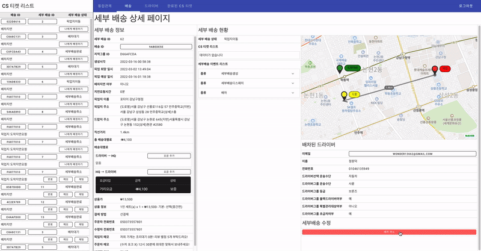
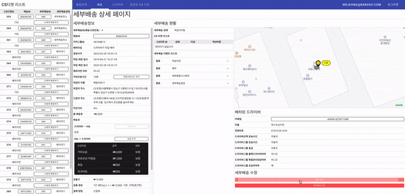

# 🛺배차취소

# 배차취소가 가능한 세부배송 상태

1. 픽업 이전 상태: 
    1. 세부배송생성(CREATED)
    2. 배차대기(READY_GRAB)
    3. 픽업지이동중(GOING_TO_PICKUP)
    4. 배차취소(CANCELED_GRAB)
2. 배송 진행중인 상태:
    1. 픽업지이동중(GOING_TO_PICKUP)
    2. 드랍지이동중(GOING_TO_DROP)
    3. 픽업지도착(ARRIVED_PICKUP_POINT)
    4. 드랍지도착(ARRIVED_DROP_POINT)

# 시나리오

1. 배차취소가 가능한 상태의 배송이어야 버튼:”배차취소”가 활성화됩니다.
2. 세부배송 우측 하단의 버튼:”배차취소”을 누르면 다이얼로그가 뜹니다.
    
    
    
3. 다이얼로그:”배차취소”에 사유를 선택하고 저장을 누르면 배차취소가 완료됩니다.
    
    