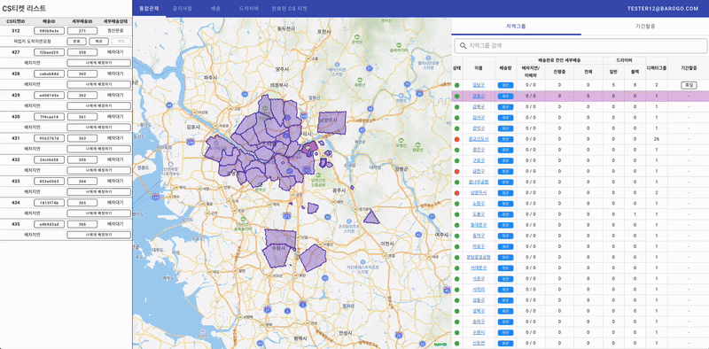
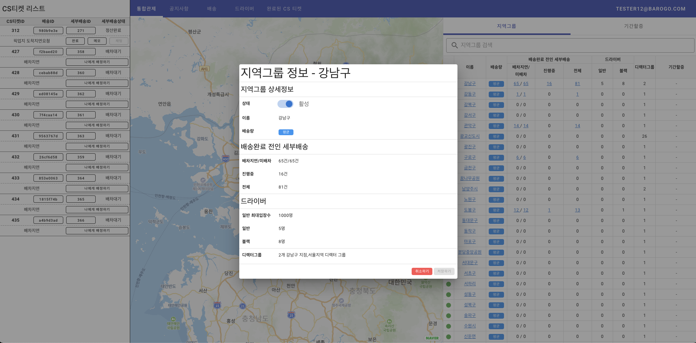
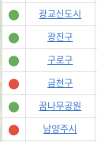
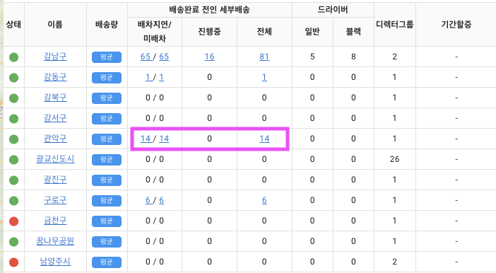
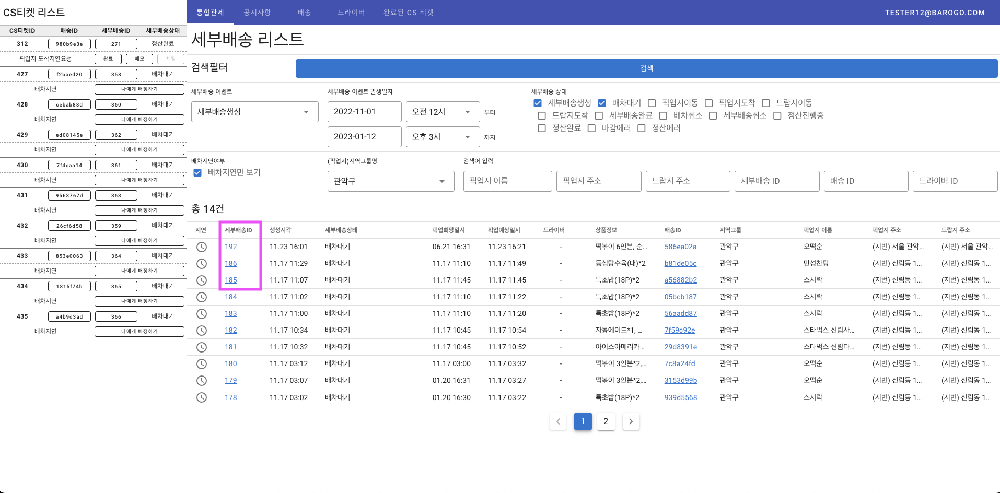

# 📊통합관제

# 배경

- 전체 배송의 상황을 한번에 알 수 있는 기능이 요구됨
- 배송이 가능한 지역과 그렇지 않은 지역을 제어할 수 있어야 함
- 지역별 할증을 추가하고 해제할 수 있어야 함
- 지역별 배송 상태, 드라이버 숫자에 대해 알수 있어야 함

# 주요 기능

## 지역그룹 표시(지도, 리스트)

- 지역그룹 활성화 및 포커스
    - 지역그룹 지도 클릭 시 해당 지역그룹 리스트 활성화 및 포커스
    - 리스트 클릭 시 해당 지도 활성화 및 포커스
- 리스트에서 지역그룹 이름으로 검색 가능

## 지역그룹 상태 변경
- 지역그룹 “광교신도시”를 활성에서 비활성으로 변경

  

- 지역그룹 상태 변경 다이얼로그

  

- 지역그룹의 상태를 변경하여 활성 || 비활성으로 구분할 수 있다. 비활성이 되면 드라이버들은 해당 지역그룹의 입장이나 배달을 받을 수 없다.
- 비활성이 될 경우 상태가 빨간색, 활성인 경우 초록색으로 표시된다.
    
  
    

## 배송 완료 전 세부배송 정보

- 배송완료 전 세부배송 항목을 클릭하면 해당되는 상태의 세부배송 목록으로 진입합니다. 여기서 목록의 각 세부배송의 상세페이지로도 다시 진입할 수 있습니다.

  

- `관악구`의 `배차지연`을 클릭 시 아래의 사진과 같이 해당 세부배송 건의 요약 내용을 알 수 있다.

  

- 세부배송ID 클릭 시 세부배송 상세 페이지로, 배송ID클릭시 배송 상세 페이지로 이동한다.

  

