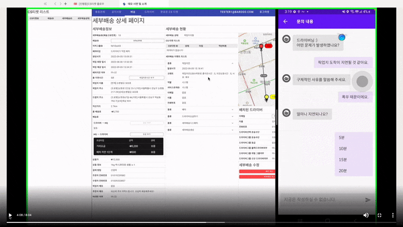
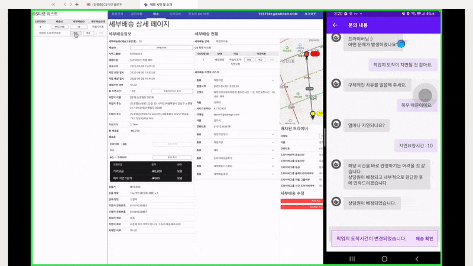

# 🎟️CS티켓 플로우

# CS티켓 카테고리

- 일반(normal)
- 배송(delivery)

# 일반 CS티켓 타입

| 가입 | accountRegister |
| --- | --- |
| 탈퇴 | accountWithdrawal |
| 운송수단 | transportation |
| 활동지역 | physicalGroup |
| 등급 | grade |
| 보험 | insurance |
| 서류발급 | document |
| 정산 | feeAdjust |
| 기타 | custom |

# 배송 CS티켓 타입

| 픽업지 실수 | mistakeByPickupPoint |
| --- | --- |
| 크로스 배송 | crossDelivery |
| 픽업지 도착지연요청 | pickupDelay |
| 배차를 취소하고 싶어요 | askCancelGrab |
| 제(드라이버)가 실수했어요 | mistakeByDriver |
| 배송이 취소되었어요 | canceledDelivery |
| 드랍지에 고객이 없어요 | notExistCustomerAtDropPoint |
| 드랍지 주소가 틀려요 | wrongDropPointAddress |
| 드랍지 도착지연요청 | dropDelay |
| 배차지연 | delayGrab |
| 기타 | custom |

# CS티켓 사유

| 상담사 문의 | custom |
| --- | --- |
| 사업소득원천징수 영수증 발급 | withholdingTaxReceipt |
| 해지사실확인서 | requestAccountWithdrawalDate |
| 채권포기(배송료포기) | giveUpDeliveryFee |
| 정산내역확인 | requestCompletedFeeAdjust |
| 정산계좌변경 | changeFeeAdjustAccount |
| 픽업지 상품누락 | missingProductByPickupPoint |
| 픽업지 영업종료 | closePickupPoint |
| 픽업지 주소 오류 | invalidAddress |
| 과적 | overload |
| 픽업지 미스패킹 | missPackingProduct |
| 픽업지 상품파손 | damagedProductByPickupPoint |
| 배송불가상품 | impossibleDeliveryProduct |
| 크로스 배송 | crossDelivery |
| 폭우 | heavyRain |
| 폭설 | heavySnow |
| 강풍 | strongWind |
| 주차불가/교통체증 | trafficJam |
| 드라이버 변경 | changeDriver |
| 기타 | etc |
| 이동수단 고장/주유/배터리 부족 | transportationProblem |
| 조리지연(매장대기) | pickupDelayByPickupPoint |
| 드랍지거리 | dropPointDistance |
| 픽업지거리 | pickupPointDistance |
| 배송 중 교통사고 | trafficAccident |
| 오배송 | missingProductByDriver |
| 드라이버 상품파손 | damagedProductByDriver |
| 드라이버 상품유실 | lostProduct |
| 배달상태변경 | changeSubDeliveryStatus |
| 배송취소 | canceledDelivery |
| 드랍지 고객부재 | notExistCustomerAtDropPoint |
| 드랍지 주소오류 | wrongDropPointAddress |
| 드랍지 도착지연요청 | dropDelay |
| 배차지연 | delayGrab |

# CS티켓 상태

| 등록 | register |
| --- | --- |
| 배정 | assign |
| 완료 | done |

# 시나리오

1. 배송중인 드라이버의 앱에서 이미 픽업지연요청 5분이 있는 배송 관련 CS티켓 타입:”픽업지 도착지연 요청”을 생성. 그 뒤에 디렉터 웹에서 위 CS 티켓을 확인하여 할당받음
    
    
    
2. 디렉터가 디렉터 웹에서 내용을 확인하고 픽업지 도착시간 지연처리를 함
    
    

    
3. CS 티켓에 메모-이력을 남기고 완료처리함
    
    