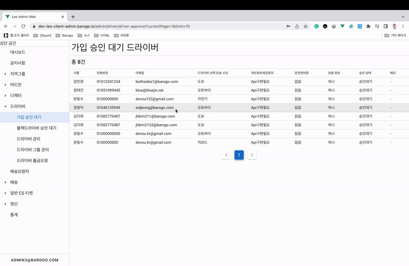

# 🛵드라이버 회원가입 플로우
# 드라이버 승인 상태
| 상태 | status |
| --- | --- |
| 대기 | wait |
| 승인 | approve |
| 거절 | reject |

# 시나리오

1. 드라이버 모바일 앱에서 회원가입 및 드라이버 가입
    
    
    
    
    
2. Admin web에서 드라이버 승인
    
    
    
3. 드라이버 모바일 앱에서 로그인 성공
    
    