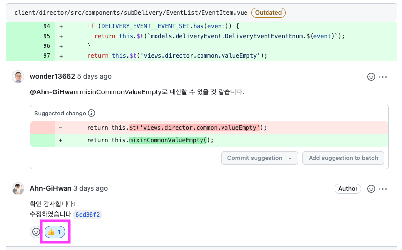

# 🔧FE 개발 컨벤션 운영
# #1 배경

- 코드 리뷰시마다 사소한 부분의 차이들에 대해 맞추기 위해 추가적인 비용이 발생했음.
    - 카멜 케이스인가, 파스칼 케이스인가?
- 기술적인 선택을 해야 할 때, 둘 다 맞는 타당한 결정이거나 명확한 답이 없는 경우, FE파트에서 방향을 정해 판단의 비용을 줄일 필요가 있었음
    - Api 통신시 실패가 발생하면 에러를 핸들링하는 위치는 어디가 되어야 하는가? View인가? Service 레이어인가?

# #2 대응

- PR 리뷰 혹은 데일리 직후 짧은 미팅을 통해서 FE파트 코딩 규칙을 정해야 하는 것을 컨벤션 페이지에 후보로 등록해둠.
- 주기적으로 후보로 등록해둔 내용에 대해 FE파트 코딩 정식 규칙으로 결정함
- 이를 코드 작성 기본 룰로 따름

# #3 성과

- PR 리뷰시 애매한 부분에 대한 질문이 줄어듬. PR 리뷰 시간이 축소됨.
- 개발적인 문제로 소통을 할 때도 공통의 개념과 용어를 사용하게 되어 경제적인 소통이 가능해졌음.

---
# #4 산출물

# Vue2

## Router

1. Restful Api Url 컨벤션을 Vue Router url에 적용
    1. 컬렉션 리소스
        
        ```jsx
        customers
        ```
        
    2. 싱글턴 리소스
        
        ```jsx
        customers/{customerId}
        ```
        
    3. 리소스는 sub-collection 리소스를 포함할 수 있다
        
        ```jsx
        customers/{customerId}/accounts
        ```
        
    4. 긴 문자열이나, 읽히기 어려운 문자열에 대해 kebab-case로 가독성을 높인다
        
        ```jsx
        // BAD
        http://api.example.com/inventory-management/managedEntities/{id}/installScriptLocation
        // GOOD
        http://api.example.com/inventory-management/managed-entities/{id}/install-script-location
        ```
        
    5. 실제 사례
        
        ```jsx
        /requesters // requester 목록 페이지
        /requesters/{id} // requester 1명에 대한 상세 페이지
        /requesters/{id}/contract // requester 1명의 계약 정보
        /requesters/{id}/wallet // requester 1명의 wallet
        ```
        
    6. Vue router의 중첩 router를 사용해서 위 Restful Api convention 구조를 나타내도록 한다.
    7. [관련 논의](https://github.com/barogo/leo/pull/3070#pullrequestreview-1077651646)
    8. 참고 자료
        
        [깔끔한 URL 패턴을 위한 REST Resource Naming Guide](https://velog.io/@pm1100tm/%EA%B9%94%EB%81%94%ED%95%9C-URL-%ED%8C%A8%ED%84%B4%EC%9D%84-%EC%9C%84%ED%95%9C-REST-Resource-Naming-Guide)
        
        [Use RESTful service URLs - API Design Guide 0.1 documentation](https://apiguide.readthedocs.io/en/latest/build_and_publish/use_RESTful_urls.html)
        
2. ~~(depreacted)중첩 라우트(Nested Router)를 사용하지 않는 이유 [관련논의](https://github.com/barogo/leo/pull/3070#issuecomment-1216212756)~~
    1. 가독성과 유지보수의 이점
        1. View의 구조와 Router 구조를 최대한 유사하게 맞추어 가독성을 높입니다.
    2. 중첩구조는 인식의 어려움
        1. 데이터의 성격이 중첩을 나타내야 하는 상황이 아니라면 최대한 중첩 표현을 배재하는 것이 현재의 방향성입니다.
    3. 사용하지 않게 된 이유
        1. [Restful Api Url 컨벤션을 Vue Router url에 적용](https://www.notion.so/ad83c5e8927142a189926edde3b4c83f) 을 사용하기로 했기 때문
3. ~~(deprecated)`requester/requester-list`처럼 반복되는 네이밍 형식의 이유 [관련논의](https://github.com/barogo/leo/pull/3070#issuecomment-1216212756)~~
    1. 해당 View component를 빠르게 검색하기 위한 네이밍입니다. 만일 `requester/list`로 router를 잡는다면, View component도 이와 일치하는 `requester/list.vue`로 작성하게 됩니다. 이 경우, list.vue는 `notice/list.vue`, `delivery/list.vue`처럼 중복되는 검색 결과를 노출할 수 있으므로 원하는 결과를 찾는데 방해가 됩니다. 그러므로 검색의 이점을 위해 2개 이상의 단어로 고유성을 나타낼 수 있는 네이밍을 선택하게 되었습니다. 아울러 [Vue style guide:Tightly coupled component names](https://v2.vuejs.org/v2/style-guide/?redirect=true#Tightly-coupled-component-names-strongly-recommended)를 반영한 측면도 있습니다.
    2. 사용하지 않게 된 이유
        1. [Restful Api Url 컨벤션을 Vue Router url에 적용](https://www.notion.so/ad83c5e8927142a189926edde3b4c83f) 을 사용하기로 했기 때문

## Naming

1. 이벤트리스너: `on${EventName}${TargetName}`
    
    ```html
    <template>
    	<MyComponent
    		@click="onClickMyComponent"
    	/>
    </template>
    <script>
    export default {
    	...
    	methods: {
    		onClickMyComponent() {
    			// do something
    		},
    	},
    };
    </script>
    ```
    

## Vuex

1. 컴포넌트 내의 store.dispatch의 호출을 메서드로 감싸는 것은 2회 이상 반복되는 경우를 기준으로 한다. 
    1. 이유
        1. action의 이름을 문자열로 직접 보냄으로 발생하는 오타를 막기 위함
        2. 코드의 간결성도 이점이 있음
    2. 예제코드
        
        ```jsx
        <script>
        export default {
        	...
        	methods: {
        		async onChangePage() {
        			await this.fetchHQWalletStatement();
        		},
        		async onClickMyComponent() {
        			await this.$store.dispatch('hqWallet/fetchHQWalletMoneyTransaction');
        			await this.fetchHQWalletStatement();
        		},
        		async fetchHQWalletStatement() {
        			this.$store.dispatch('hqWallet/fetchHQWalletStatement');
        		},
        	},
        };
        </script>
        
        ```
        
2. Action의 Api 응답으로 받은 속성 중 배열이 가공하거나 조회할 대상이라면 무조건 null 검사해서 빈배열로 초기화
    1. 사례: https://github.com/barogo/leo/pull/3240/files
        
        ```jsx
        if (!utils.isValidArray(recommendBlackDrivers)) {
              recommendBlackDrivers = [];
            }
        
            recommendBlackDrivers = recommendBlackDrivers.map((v) => {
              const {
                Driver: {
                  ShippingSubDeliveries,
                },
              } = v;
              if (!utils.isValidArray(ShippingSubDeliveries)) {
                return {
                  ...v,
                  Driver: {
                    ...v.Driver,
                    ShippingSubDeliveries: [],
                  },
                };
              }
              return v;
            });
        ```
        
3. State의 배열 값 상태 관리
    1. api 결과 받기 전: null
    2. api 결과 받은 후(결과가 없다면): [](null로 들어와도 클라이언트에서 빈 배열로 처리해서 유지할 것!)
    3. api 결과 받은 후(결과가 있다면): [{...}, {...}]
4. Action 레이어의 parameter에 대한 검증(validation)
    1. parameter에 대한 검증은 하지 않음. parameter의 검증은 view component에서 `store.dispatch` 시점에 하는 것으로 협의함
    2. 검증하지 않는 이유
        1. actions에서 validation이 추가되면, view component와 중복되는 경우가 생김. 효율적으로 view component 한 곳에서만 검증을 진행하도록 하자.
    3. 몇몇 경우에 대해서 actions에서 받는 parameter에 대해서 검증(validaiton)을 필요하다고 보는 경우가 있었음. view component와 actions는 별도의 모듈이라고 보는 관점이라는 이 이야기가 타당함. 하지만 위의 이유들로 검증은 한 곳(view component)에서만 하는 것으로 정의.
5. Socket의 이벤트 흐름 (Socket(event.on) → store.dispatch(service 포함) → store → views)
    
    ```jsx
    const socketClient = {
    	onReceiveMsgGrabSubDelivery(msg) {
    		// 1. 소켓 서버로부터 메시지를 받습니다.
    		store.dispatch('updateSubDeliveryBySocket', msg)
    	}
    }
    
    const store = {
    	actions: {
    		updateSubDeliveryBySocket(msg) {
    			// 2. socket client에서 받은 메시지처리
    			const {
    				subDelivery,
    			} = msg;
    
    			// 2-1. resourceWatcher에서 사용중인 리소스들만 업데이트하도록 조건 검사
    			if (resourceWatcher.has(RESOURCE_DELIVERY)) {
    				// 2-1-1. 여기에 전처리 단계가 들어갈 수 있습니다.
    				// 2-1-2. service에서 전달받은 subDelivery 내용으로 업데이트
    				COMMIT(UPDATE_SUBDELIVERY, subDelivery);
    				// 2-1-2. 여기에 후처리 단계가 들어갈 수 있습니다.
    			}
    
    			// 2-2. 여기서 필요하다면 service를 호출할 수 있습니다.(service 포함)
    			const result = someService.fetchList();
    			COMMIT(UPDATE_SOMETHING, result);
    		}
    	},
    	getters: {
    		subDelivery(state) {
    			return state.subDelivery;
    		}
    	}
    }
    
    const component = {
    	computed: {
    		subDelivery() {
    			// 3. 최신 subDelivery를 store에 가져와 컴포넌트에 표시합니다.
    			return store.getters['subDelivery'];
    		}
    	}
    }
    ```
    

## Base Component

1. BaseTextArea
    1. 비활성화 설정은 disabled가 아닌 readonly를 사용하자
        1. 이유: disabled는 스크롤이 불가해서 textarea 영역 바깥의 내용을 볼 수 없음. readonly는 스크롤 가능.
2. (후보)Base Component의 역할에 따라 atom, molecules, organisms, template, page로 구분
    
    [Scalable Frontend Component: Atomic Design](https://medium.com/@justarya/scalable-frontend-component-atomic-design-851dd29aa01f)
    
    *BaseComponent작업 완료 뒤 최종 결정
    

## Mixins

1. view단위로 파일 생성(이름도 동일하게 사용)
2. mixin과 해당 컴포넌트를 식별하기 위해 mixin[파일명][name] 컨벤션을 적용
- 예시

```jsx
// src/mixins/notice.js

//...

export default {
  methods: {
    mixinNoticeCategoryReadable(category) {
      if (!NOTICE__CATEGORY_SET.has(category)) {
        return VALUE_EMPTY;
      }
      return this.$t(`models.notice.NoticeCategoryEnum.${category}`);
    },
    mixinNoticePushPlanOption(pushPlanOption) {
      if (!NOTICE__TARGET_PUSHPLAN_OPTION_ENUM_SET.has(pushPlanOption)) {
        return VALUE_EMPTY;
      }
      return this.$t(`models.notice.NoticeTargetPushPlanOptionEnum.${pushPlanOption}`);
    },
  },
};

// src/views/director/notice/index.vue

//...

const messageTargetReadable = messageTargets.length > 0 ? messageTargets.join(',') : this.mixinCommonValueEmpty();
const pushMessageYesOrNotReadable = this.mixinCommonValueYesOrNo(PushPlan);
const categoryReadable = this.mixinNoticeCategoryReadable(category);
const createdAtReadable = utils.convertUTCToLocalYYYYMMDDHHmmss(createdAt);

//...
```

# Graphql

- ServiceLayer의 query, mutation 인자는 서버코드에 설정한 타입의 이름을 그대로 사용한다.
    - 이유: 가독성과 검색의 편의성을 높이기 위함
        
        ```jsx
        
        // app/presenter/src/graphql/schemas/pushPlan.graphql
        type Mutation {
          """
          푸시알림 생성
          | 에러 카테고리 (category) | 에러 코드 (errorCode) | 설명 |
          | ------ | ------ | ------ |
          | NOT_FOUND | NOT_FOUND_RESOURCE | 조건에 일치하는 값을 찾을 수 없는 경우 |
          | CONFLICT | DUPLICATED_ID | 이미 기존에 요청한 경우 |
          """
          createPushPlan(input: CreatePushPlanData!): PushPlan
        }
        
        input **CreatePushPlanData** {
          "notice ID"
          noticeId: ID
          "푸시알림 본문"
          contents: String!
          "푸시알림 드라이버 대상 여부"
          targetDriverFlag: Boolean!
          "푸시알림 디렉터 대상여부"
          targetDirectorFlag: Boolean!
          "메시지 받을 지역 전체 여부"
          isTargetingAllPhysicalGroup: Boolean!
          "푸시 이벤트가 시작되는 날짜"
          pushEventsBeginsAt: DateTime!
          "푸시 이벤트가 종료되는 날짜"
          pushEventsEndsAt: DateTime!
          "푸시알림 받을 physicalGroup ID 목록"
          physicalGroupIds: [ID]
          "푸시알림 이벤트 시간"
          eventAtHHmmList: [Time!]!
        }
        
        // src/services/graphql/pushPlan.js
        async createPushPlan({
            **CreatePushPlanData**: { // 여기서 이름을 그대로 가져와 사용
              noticeId,
              contents,
              targetDriverFlag,
              targetDirectorFlag,
              isTargetingAllPhysicalGroup,
              pushEventsBeginsAt,
              pushEventsEndsAt,
              physicalGroupIds,
              eventAtHHmmList,
            },
          }) {
            const { data: result, error } = await apolloClient.getInstance().mutate({
              mutation: createPushPlan,
              variables: {
                input: {
                  ...(noticeId && { noticeId }),
                  contents,
                  targetDriverFlag,
                  targetDirectorFlag,
                  isTargetingAllPhysicalGroup,
                  pushEventsBeginsAt,
                  pushEventsEndsAt,
                  ...(utils.isValidArray(physicalGroupIds) && { physicalGroupIds }),
                  eventAtHHmmList,
                },
              },
            });
        
            if (error) {
              throw error;
            }
        
            return result;
          },
        ```
        
- graphql CRUD 메서드의 네이밍
    - 결론: 명시적으로 표현하는 방식을 쓰자
    - fetchOne vs fecthNotice
        
        ```jsx
        // Bad
        services.graphql.notice.fetchOne();
        // Good
        services.graphql.notice.fecthNotice();
        ```
        
    - fetchList vs fetchNoticeList
        
        ```jsx
        services.graphql.notice.fetchList();
        services.graphql.notice.fetchNoticeList();
        ```
        
    - create vs createOne vs createNotice
        
        ```jsx
        services.graphql.notice.create();
        services.graphql.notice.createOne();
        services.graphql.notice.createNotice();
        
        services.graphql.notice.createMoneyTransactionDetails();
        services.graphql.notice.createOptionFeeWithRequestHistory();
        ```
        
    - update vs updateOne vs updateNotice
        
        ```jsx
        services.graphql.notice.update();
        services.graphql.notice.updateOne();
        services.graphql.notice.updateNotice();
        ```
        
- Create, Update 이후에 Read를 다시 하는 동작은 View Component에서 수행한다. Action 단에서 연속으로 호출하지 않는다.
    - 이유:
        - Create와 Read가 강하게 의존성을 가지면 유연성이 떨어짐.
        - action 안에서는 1개의 기능만 동작하게 하자(SRP:단일책임원칙)
    
    ```jsx
    // Bad
    // Vuex.action 
    async fetchList() {
    	await services.graphql.notice.fetchList();
    }
    async createNotice() {
    	await services.graphql.notice.createNotice();
    	await dispatch('fetchList', {});
    }
    
    // Good
    // View component
    methods: {
    	async onSubmit() {
    		await this.$store.dispatch('notice/createNotice');
    		await this.$store.dispatch('notice/fetchList');
    	}
    },
    
    // Vuex.action 
    async fetchList() {
    	await services.graphql.notice.fetchList();
    }
    async createNotice() {
    	await services.graphql.notice.createNotice();
    }
    ```
    

# Constant(상수)

1. 어떤 개념의 속성을 나타낼 때, `${개념}__${속성}`의 컨벤션을 사용한다 [관련 논의](https://github.com/barogo/leo/pull/3353#discussion_r963384624)
    
    ```html
    DELIVERY_EVENT__ROLE_SET
    ```
    
2. graphql의 enum 값은 서버의 표현을 따른다. 현재는 [PascalCase](https://namu.wiki/w/%EC%BD%94%EB%94%A9%20%EC%8A%A4%ED%83%80%EC%9D%BC#s-3.2)를 쓰고 있음. 이는 i18n에도 동일하게 적용된다.
    
    ```graphql
    enum RequesterContractOptionFeeTypeRateTypeEnum {
      deliveryFee
      distance
      fixed
      productPriceCompensation
    }
    ```
    
3. 클라이언트 내부에서 정의한 상수는 [snake_case](https://namu.wiki/w/%EC%BD%94%EB%94%A9%20%EC%8A%A4%ED%83%80%EC%9D%BC#s-3.3) + UPPER_CASE로 표현한다. 문자열 값도 동일한 컨벤션으로 작성. 이는 i18n에도 동일하게 적용된다.
    
    ```jsx
    PAGINATION_LIMIT_SMALL: 5,
    PAGINATION_LIMIT_DEFAULT: 10,
    PAGINATION_LIMIT_LARGE: 1000,
    PAGINATION_CURRENT_PAGE_DEFAULT: 1,
    
    PAGE_MODE: {
      DIRECTOR_GROUP_READ: 'DIRECTOR_GROUP_READ',
      DIRECTOR_GROUP_CREATE: 'DIRECTOR_GROUP_CREATE',
      DIRECTOR_GROUP_UPDATE: 'DIRECTOR_GROUP_UPDATE',
    },
    ```
    

## 조건문

- 삼항 연산자보다 if-return을 사용한다.

```jsx
// Bad
const mixinDeliveryStatusReadable = (deliveryStatus) => {
	return DELIVERY_STATUS_SET.has(deliveryStatus) ? this.$t(`models.delivery.DeliveryStatusEnum.${deliveryStatus}`) : valueEmpty
}

// Good
const mixinDeliveryStatusReadable = (deliveryStatus) => {
  if (!DELIVERY_STATUS_SET.has(deliveryStatus)) {
    return valueEmpty;
  }
  return this.$t(`models.delivery.DeliveryStatusEnum.${deliveryStatus}`);
}
```

# Code Review

1. 수정사항 확인이 완료된 것을 확인했을때는 따봉👍
    
    
    
2. 수정사항에 대해서 반드시 작동화면을 영상으로 기록해서 업데이트하도록 한다.

# Test

## 테스트 코드 작성 대상

- 공용 모듈화된 메서드들. ex) utils, mixins
- Vuetify의 input, textarea에 적용되는 rules 로직들
    - 사례: https://github.com/barogo/leo/issues/3933

# UI

- Textarea와 Input은 placeholder로 빈값을 나타낸다. 이 경우 노출되는 메시지는 아래 포맷처럼 표시한다.
    
    ```jsx
    placeholder: "${value}를 입력해주세요"
    ```
    
- 테이블 컬럼의 셀의 빈값은 ‘-’로 표시한다.

# Error Handling

## try/catch

- Api 통신을 수행하는 모듈단에서는 데이터에 대한 처리만 담당한다
    
    ```jsx
    // action layer
    // src/store/modules/auth/actions.js
    	async getEmail({ dispatch }, { name, phoneNumber }) {
        try {
          const response = await services.rest.auth.getEmail(name, phoneNumber);
          const { status } = response;
          if (status !== HTTP_RESPONSE_STATUS_CODE.OK_200) {
            // TODO 에러 데이터의 가공(클라이언트가 사용하는 에러코드)이 필요합니다.
            throw new Error(response?.data?.error);
          }
          return response?.data;
        } catch (error) {
          dispatch('error/addError', error, { root: true });
          throw error;
        }
      },
    ```
    
- Api 통신 결과를 받은 View 컴포넌트 쪽에서 표시할 메시지를 가공하는 작업을 수행한다.
    
    ```jsx
    
    // view layer
    // src/views/auth/FindEmail.vue
    async onClickFindEmail() {
      try {
        // 1. ID 찾기 요청
        const { name, phoneNumber } = this;
        const data = await this.$store.dispatch('auth/getEmail', { name, phoneNumber });
        const { email } = data;
        // 2. ID 찾기 결과페이지로 이동
        this.$router.push({
          name: 'FindEmailResult',
          params: {
            email,
          },
        });
      } catch (error) {
        // 3. ID 결과 찾기 실패. 실패 다이얼로그 노출
    		// TODO 클라이언트 에러코드에 따른 메시지 맵이 필요합니다.
        this.dialog = {
          isShow: true,
          title: this.$t('views.auth.findEmail.dialogFindEmailFailTitle'),
          content: this.$t('views.auth.findEmail.dialogFindEmailFailContent'),
        };
      }
    },
    
    ```
    

### 관련 논의

- [PR 리뷰 #4237](https://github.com/barogo/leo/pull/4237#discussion_r1047156687)

# General(일반)

## Import 순서

1. 외부 모듈
2. 서비스 공용 모듈
3. 작성하는 코드와 인접한 모듈

```jsx
// 외부 모듈
import axios from 'axios';
// 서비스 공용 모듈
import BaseSearchTable from '@/components/base/composite/BaseSearchTable';
import BaseButtonXSmall from '@/components/base/BaseButtonXSmall';
import utils from '@/lib/utils';
import {
  COMMON__PAGINATION_CURRENT_PAGE_DEFAULT,
  COMMON__PAGINATION_LIMIT_SMALL,
} from '@/lib/constants';
import mixins from '@/mixins';
// 작성하는 코드와 인접한 모듈
import CSTicketDialog from '../components/CSTicketDialog';
```

## Utils

- 외부 라이브러리(moment 등)은 가능한한 외부로 노출하지 말고, utils에서 wrapping해서 사용하도록 하자.
- 자주 사용되는 경우(3회이상)의 외부 라이브러리(ex: moment)에 대해서 utils로 추가하는 것을 진행합니다. 그 외의 상황에는 자유롭게 사용하도록 합니다. [관련 논의](https://github.com/barogo/leo/pull/4079#discussion_r1035419838)

## Method Return

- 메서드의 마지막에 결과값을 리턴할 경우, 함수 호출구문을 그대로 리턴하는 것이 아닌 결과값을 받아서 리턴하는 형태로 만들자
- 이유
    - 비동기 함수를 호출할 경우, Promise를 리턴하는데 동기함수처럼 처리하는 것을 막기 위함. 에러났을때 찾기 골아프고 시점 체크가 잘 안됨.
    - 리턴하는 결과에 대한 후처리 등을 용이하게 하기 위한 목적

```jsx
process(v) {
	// 인자를 받아 처리합니다.
  return v + 1;
}
// BAD
doSomting() {
	return process(v);
}
// GOOD
doSomthingBetter() {
	const result = process(v);
	return result; 
}
```

# Data flow

- Flux의 기본 철학인 One way data flow(단방향 데이터 흐름)을 준수합니다.
    
    [In-Depth Overview | Flux](https://facebook.github.io/flux/docs/in-depth-overview)
    
- 데이터 조회가 필요한 경우(graphql의 경우)
    - Vue component -> @/store/${모듈}/Actions -> @/services/${리소스} -> @/lib/graphql/apolloClient 의 흐름으로 연결됩니다.
