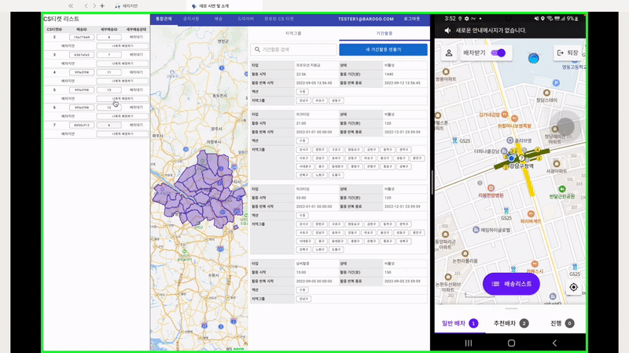
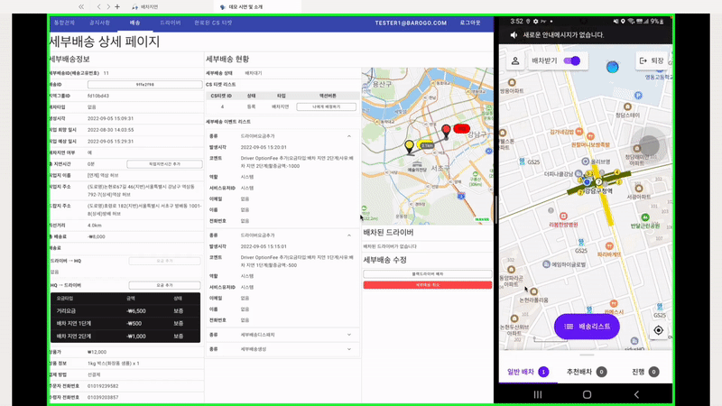

# 🎣배차지연 - 블랙드라이버 배차

# 블랙드라이버 여부 상태값

- 드라이버의 블랙드라이버 여부는 DriverGroup 중 “blackDriver”에 해당되는지 여부입니다.

# CS티켓과 세부배송 상태

- CS티켓과 세부배송 상태는 연결되어 있지 않습니다. 그러므로 CS티켓:배차지연을 받은 상태에서 세부배송이 배차되더라도 CS티켓:배차지연은 그대로 남아있습니다. 이 CS티켓은 수동으로 완료처리를 해야 합니다.

# 시나리오

1. 배차가 지연된 배송건에 대해 CS티켓이 발행됩니다. 발행된 CS티켓을 디렉터가 자신에게 배정합니다.
    
    
    
2. 디렉터가 해당 배송에 대해 블랙 드라이버를 배차합니다.
    
    