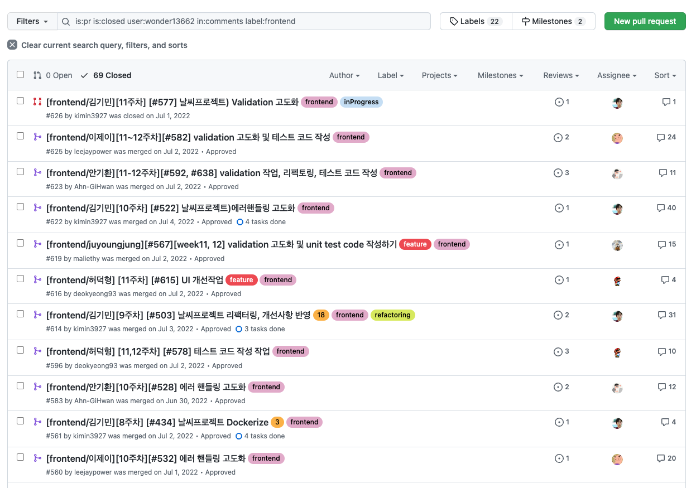
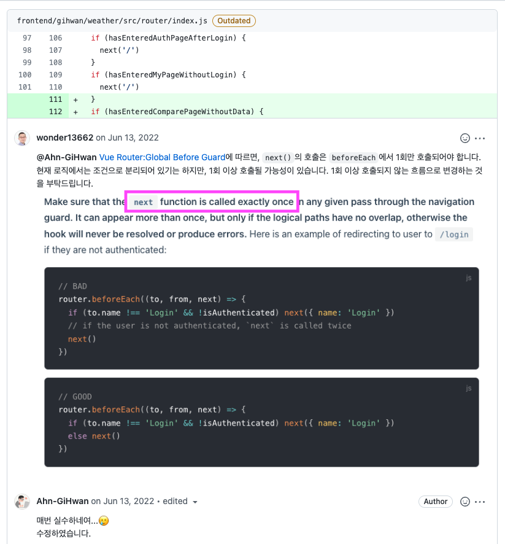

# 인턴쉽 멘토링 참여

# #1 배경

- 개발 인력충원에 어려움을 겪어 개발 조직 안에서 인턴 프로그램을 운영하기로 함

# #2 진행과정

- 직접 신입을 받아 4개월간 교육한 뒤 평가과정을 거쳐 정직원으로 전환
- 4개월간 백엔드 5명, 프론트 5명과 함께 4개의 토이 프로젝트를 진행함
- 관련 코드는 회사 Github의 private repo로 관리됨
- 프론트 5명에 대한 코드 리뷰 및 데모 피드백을 담당

# #3 성과

- 프론트 지원 인원 5명 중 4명(80%)가 평가과정을 통과할 수 있었음
- 4개월간 총 69개의 PR에 대해 평균 20개 가량의 코멘트
    
    

- 최대한 공식적이고 타당한 근거를 중심으로 피드백을 드릴 수 있도록 노력했습니다.
    
    
    
- 기술 매니지먼트의 경험을 간접적으로 체험해볼 수 있었음. 매일 5인의 PR을 확인하여 답변을 해줌.
- 추후 인턴쉽에 대해 스스로 운영해볼 수 있겠다는 자신감을 가짐.
- 인턴쉽을 통과한 인원중 1명이 실제 팀에 합류하여 협업을 진행함. 합류한 뒤 3개월 뒤에는 생산성이 향상되는 결과를 얻을 수 있었음.