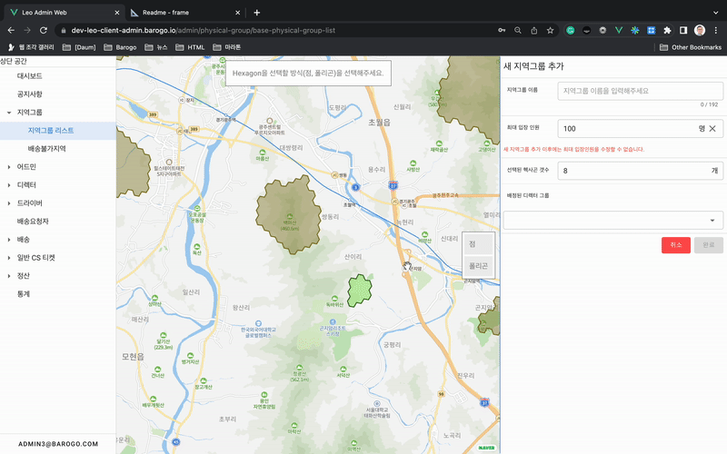
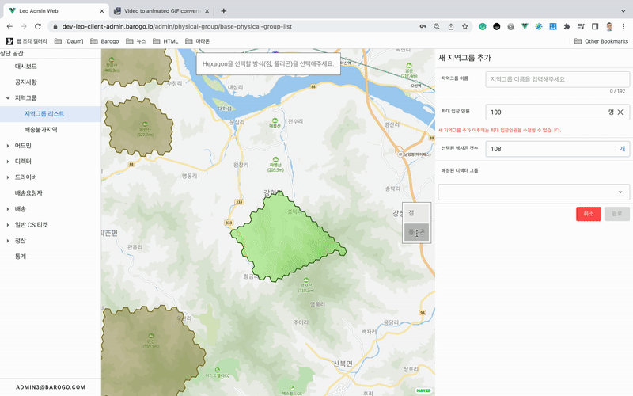
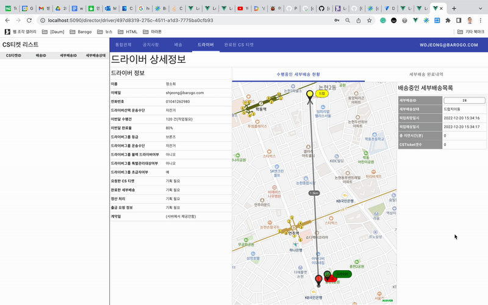
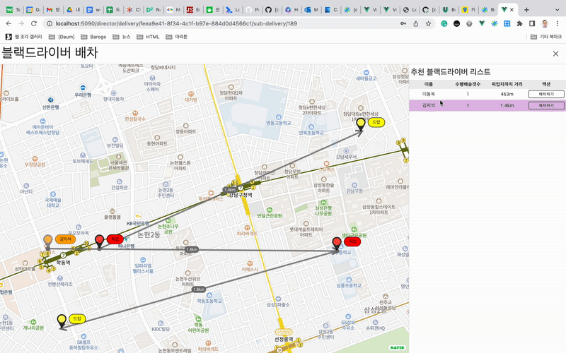
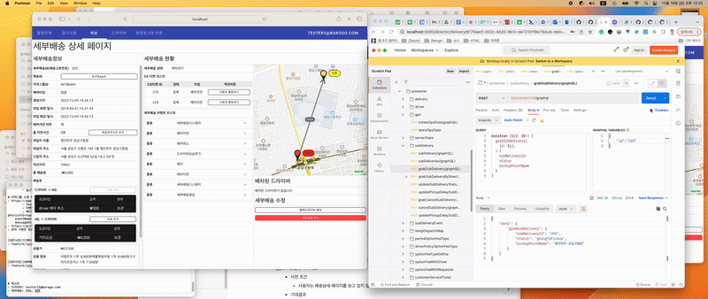

# NaverMap 모듈화

# # 배경

- NaverMap Api를 개별적으로 구현하는 경우, DOM에 직접 script tag를 작성하는 것부터 Api호출시에 필요한 보일러플레이트 작업이 많았음. 마커 하나를 표시하는데도 상당한 양의 코드를 작성해야 함.
- 개별적으로 작성한 NaverMap 관련 코드가 쌓이면서 반복되는 패턴이 보이기 시작함

# # 과정

- 반복되는 패턴들을 작은 기능 단위의 개별 모듈로 묶음
- 조금 더 복잡한 기능들은 작은 개별 기능등을 묶어서 모듈화함
- Naver Map Api의 개념들을 최대한 반영함
    - Naver Map Overlay와 각 객체의 Api 이름은 가능한한 동일하게 사용함

# # 성과

- Vue 컴포넌트에서 사용하는 경우, 적은 코드로도 Naver Map의 기능을 재사용할 수 있었음
- 모듈화 작업의 메서드 등에 JSDoc이 작성이 되어 타팀에 소스를 공유함
- 비동기 상황에서도 네이버 맵 주입이 가능해져서 유연한 지도 사용이 가능해짐

# #1 NaverMapV3

## 주요 기능

- 비동기로 naver map api를 DOM에 script 태그를 생성하여 네이버 지도를 삽입해줍니다.
- naver overlay 객체 타입(draw, remove 메서드 구현)만을 받도록 설계되었습니다. overlay 타입(duck type)을 준수하는 모든 객체를 활용할 수 있습니다.
- overlay event handler의 wrapper를 구현하였습니다. 그러므로 event handling을 더 간편하게 구현할 수 있습니다.

# #2 H3 Polygon 제어

## #2-1-1 사용자가 지도 위에 지역그룹의 H3 폴리곤을 클릭해서 n개 추가한다.

### 스크린샷

### 시나리오

1. 사용자가 “지역그룹 리스트”로 진입합니다.
2. 우측 상단의 “추가” 버튼을 누릅니다.
3. “새 지역그룹 추가” 화면으로 바뀝니다.
4. 사용자는 지도 중간 우측의 “점” 버튼을 클릭합니다.
5. 사용자는 지도 위에 임의의 위치에 좌표를 클릭해서 h3 폴리곤을 낱개로 추가합니다.
6. 사용자는 지도 중앙 상단의 “저장” 버튼을 눌러서 선택한 h3 폴리곤들을 임시 저장합니다.
7. 우측 “선택한 헥사곤 갯수”에 선택한 h3 폴리곤 갯수가 반영되어야 합니다.

## #2-1-2 사용자가 지도 위에 지역그룹의 H3 폴리곤을 클릭해서 n개 제거한다.

### 스크린샷

### 시나리오

1. “새 지역그룹 추가” 페이지에서 사용자는 H3 폴리곤을 이미 입력한 상태입니다.
2. 지도 우측 중앙의 버튼-”점”을 클릭합니다.
3. 지도 위에 선택된 H3 폴리곤 영역 위를 클릭해서 제외할 H3 폴리곤을 선택합니다.
4. 지도 우측 상단의 버튼-”저장”을 클릭합니다.
5. “새 지역그룹 추가”의 “선택된 헥사곤 갯수”의 입력필드에 제외한 H3 폴리곤 갯수만큼 뺀 숫자가 보여져야 합니다.

## #2-2-1 사용자가 지도 위에 지역그룹의 H3 폴리곤을 영역으로 추가한다.

### 스크린샷

### 시나리오

1. 사용자가 “지역그룹 리스트”로 진입합니다.
2. 우측 상단의 “추가” 버튼을 누릅니다.
3. “새 지역그룹 추가” 화면으로 바뀝니다.
4. 사용자는 지도 중간 우측의 “폴리곤” 버튼을 클릭합니다.
5. 지도 위에 폴리곤 영역을 선택하고 중앙 상단의 배너의 버튼:”더하기”를 클릭합니다.
6. 중앙 상단의 배너의 버튼:”저장”을 클릭합니다.
7. 우측 “새 지역그룹 추가”의 필드:“선택된 헥사곤 갯수”가 업데이트된 갯수를 확인합니다.

## #2-2-2 사용자가 지도 위에 지역그룹의 H3 폴리곤을 영역으로 제거한다.

### 스크린샷

### 시나리오

1. 사용자가 지도에서 사전에 입력한 폴리곤 정보가 있습니다.
2. 사용자는 지도 중간 우측의 “폴리곤” 버튼을 클릭합니다.
3. 지도 위에 폴리곤 영역을 선택하고 중앙 상단의 배너의 버튼:”빼기”를 클릭합니다.
4. 중앙 상단의 배너의 버튼:”저장”을 클릭합니다.
5. 우측 “새 지역그룹 추가”의 필드:“선택된 헥사곤 갯수”가 업데이트된 갯수를 확인합니다.

# #2 마커

## #2-1 드라이버 상세페이지의 드라이버 GPS 표시

### 스크린샷

### 시나리오

1. 드라이버 상세 페이지로 진입합니다.
2. 수행중인 세부배송 현황 탭이 선택되어 있어야 합니다.
3. 소켓 푸시 메시지(roomDriverGpsChange)를 받아서 새로운 GPS의 위치를 지도에 표시합니다.

## #2-2 블랙드라이버 강제배차 다이얼로그의 GPS 표시

### 스크린샷

### 시나리오

1. 세부배송 상세페이지의 우측 중앙의 버튼:”블랙드라이버 배차”을 클릭합니다.
2. 블랙드라이버 배차 다이얼로그(전체화면)이 노출됩니다.
3. 다이얼로그 우측의 목록에 블랙드라이버 이름이 호버가 되면 다이얼로그의 지도 위의 블랙드라이버들의 위치가 표시됩니다.

## #2-3 배차시 세부배송 상세페이지에서 드라이버의 GPS를 지도에 표시

### 스크린샷

### 시나리오

# #3 H3 폴리곤

## #3-1 지도에 여러 개의 폴리곤을 그림

### 스크린샷

### 시나리오

1. 통합관제 페이지로 진입합니다.
2. 지역그룹 H3Index를 기반으로 지도에 폴리곤을 그립니다.
3. 오른편 목록에 mouseover가 되면 지도에 연결된 지역그룹의 폴리곤이 selected 상태로 표시됩니다.