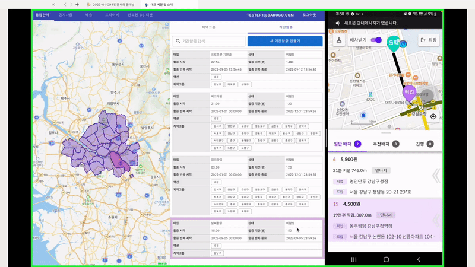

# 🪙기간할증 플로우

# 기간할증 상태

| 상태 | Status | 설명 |
| --- | --- | --- |
| 활성 | activated | 기간할증 시간조건에 해당되면 기간할증은 “활성” 상태로 바뀝니다. |
| 비활성 | deactivated | 할증반복시작, 할증반복종료 사이의 시각이지만, 할증 시작과 할증 기간 범위 바깥일때는 “비활성” 상태로 바뀝니다. |
| 종료 | terminated | 할증반복시작, 할증반복종료 범위 바깥이라면, “종료” 상태로 바뀝니다. |

# 시나리오

1. 디렉터가 통합관제 > 기간할증 탭에서 새로운 기간할증을 추가한다.
    
    
    
2. 5분 주기로 기간할증 상태를 확인하여, 유효한 시간범위에 있는 기간할증은 새로 생성되는 세부배송에 기간할증 요금이 추가된다.
    
    