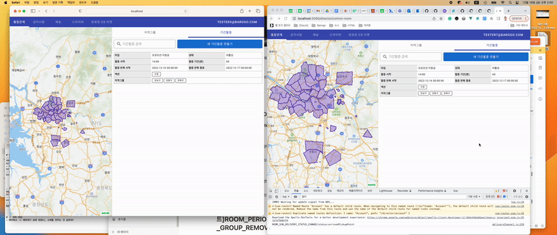

# 🚃Socket to Veux.store

# #1 배경

- 소켓에서 들어오는 메시지를 어떻게 View까지 전달해야 할지 흐름을 정해야 했음
- 모든 소켓의 메시지를 다 받을 수는 없음. 로그인한 디렉터의 조건에 맞춰 받을 메시지와 버릴 메시지를 선택하는 필터 조건이 필요했음.
- 필터링된 이후의 데이터가 가야하는 목적지를 결정해야 했음.

# #2 결과

- resourceWatcher라는 유틸리티 모듈을 만들어서, 해당 view가 관심있는 리소스를 등록하여 푸시 메시지를 받았을 때 관련된 리소스가 등록되어 있다면, 메시지를 받고 그렇지 않다면 버리는 구조로 흐름을 만듦.
- vueRouter로 현재 페이지 위치를 확인하여, 리소스를 보고 있더라도, 페이지 위치가 적절한 경우에만 푸시 메시지를 받도록 추가 필터를 둠.
- 이렇게 하여, view쪽 에서는 푸시메시지를 확인하기 위해 Vuex.store에 관련된 정보를 watch만 하고있으면 쉽게 받도록 푸시 데이터 흐름이 구성됨.

# #3 예제

## #3-1 기간할증 상태 변경

## 스크린샷

기간할증의 상태가 바뀌는 경우, 동일한 계정의 디렉터가 여러 개의 탭을 열어 두더라도 조건이 맞다면 푸시 메시지를 받아 처리하는 모습을 볼 수 있음.

## 시나리오

1. 사용자는 통합관제 화면으로 이동
2. 통합관제 화면에 진입하면, resourceWatcher에게 푸시 이벤트의 리소스 중, 다음 리소스를 푸시 메시지로 받도록 등록한다.
    1. 지역그룹(RESOURCE_BASE_PHYSICAL_GROUP)
    2. 기간할증(RESOURCE__PERIOD_OPTION_FEE)
3. 서버에서 받은 푸시 메시지 이벤트가 `roomPeriodOptionFeeTypeStatusChange` 라면, 통합관제의 기간할증 목록에서 반영된다.