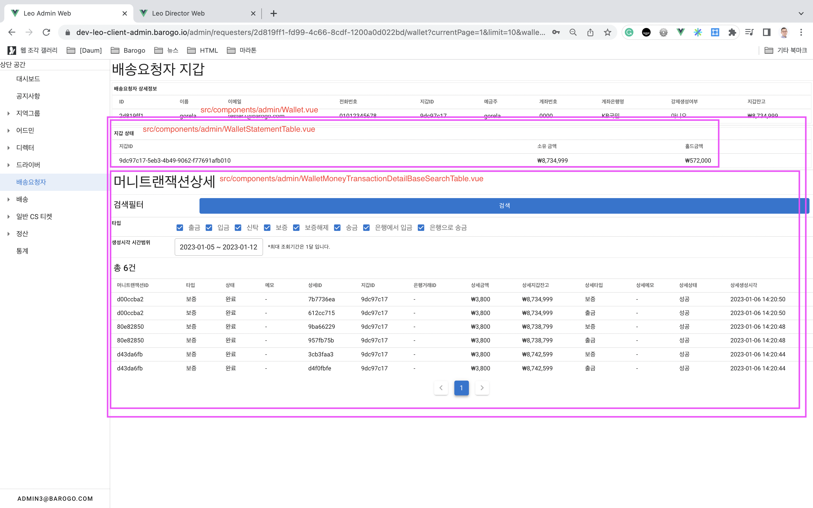
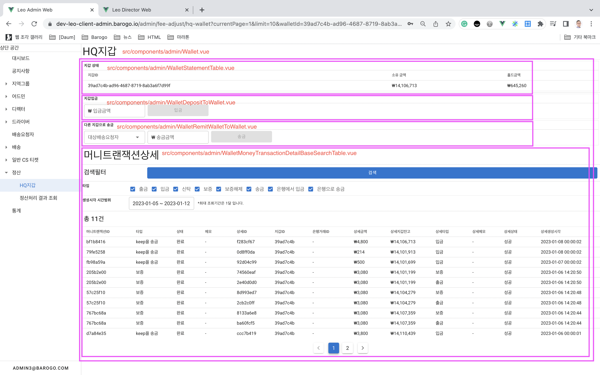

# 👛Wallet 공통 컴포넌트
# 작동방식

- Wallet 정보를 표시하기 위한 컴포넌트는 총 4가지가 제공됩니다.
    - 관리대상 지갑상태: src/components/admin/WalletStatementTable.vue `필수`
    - 관리대상 지갑 입금(충전): src/components/admin/WalletDepositToWallet.vue `선택가능`
    - 다른 지갑 송금: src/components/admin/WalletRemitWalletToWallet.vue `선택가능`
    - 검색필터 + 테이블: 머니트랜잭션상세: src/components/admin/WalletMoneyTransactionDetailBaseSearchTable.vue `선택가능`
- 각 페이지의 용도에 맞게 선택가능한 컴포넌트는 선택해서 노출, 사용합니다.

# 사용 페이지

## 드라이버 상세 정보

## HQ 지갑

## 배송요청자 지갑

